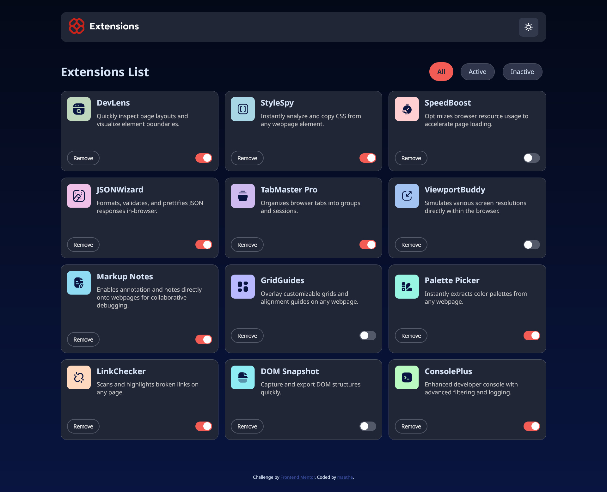
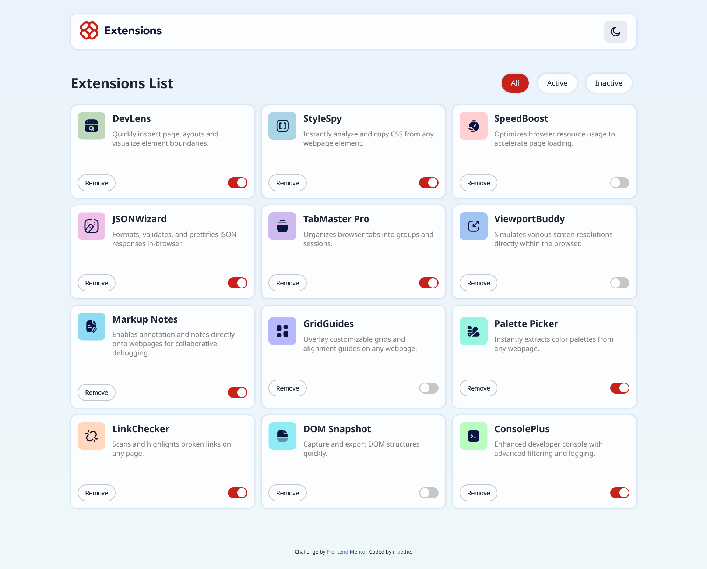
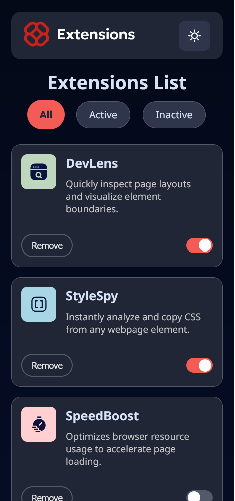
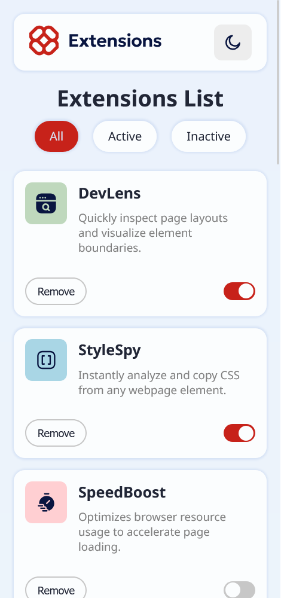

# Frontend Mentor - Browser extensions manager UI solution

This is a solution to the [Browser extensions manager UI challenge on Frontend Mentor](https://www.frontendmentor.io/challenges/browser-extension-manager-ui-yNZnOfsMAp). Frontend Mentor challenges help you improve your coding skills by building realistic projects. 

## Table of contents

- [Overview](#overview)
  - [The challenge](#the-challenge)
  - [Screenshots](#screenshots)
  - [Links](#links)
- [My process](#my-process)
  - [Built with](#built-with)
  - [What I learned](#what-i-learned)
  - [Continued development](#continued-development)
  - [Useful resources](#useful-resources)
- [Author](#author)

## Overview

### The challenge

Users should be able to:

- Toggle extensions between active and inactive states
- Filter active and inactive extensions
- Remove extensions from the list
- Select their color theme
- View the optimal layout for the interface depending on their device's screen size
- See hover and focus states for all interactive elements on the page

### Screenshots

#### Desktop




#### Mobile
 

### Links

- Solution URL: [Add solution URL here](https://your-solution-url.com)
- Live Site URL: [Add live site URL here](https://your-live-site-url.com)

## My process

### Built with

- Semantic HTML5 markup
- CSS flex styles
- CSS Grid
- Mobile-first workflow
- JavaScript DOM manipulation

### What I learned

 - Changing the image of a button using only HTML and CSS:
```css
[scheme="0"] .toggle-scheme img:last-child,
[scheme="0"] .header-logo img:last-child {
  display: none;
}
```
 - Using CSS Grid and `@media` to design a responsive card container:
```css
.cards-container {
  display: grid;
  grid-template-columns: repeat(1, minmax(200px, 1fr));
  gap: 1rem;
}

@media (min-width: 1440px) {
  body {
    padding: 2% 10%;
  }

  .header {
    margin-bottom: 5vh;
  }

  .main-header {
    justify-content: space-between;
  }

  .cards-container {
    grid-template-columns: repeat(3, minmax(200px, 1fr));
  }

  .card-top {
    margin-bottom: 5vh;
  }
}
```

Creating a slider/switch button with CSS:
```css
.toggle-active-btn {
  display: flex;
  background-color: var(--neutral-600);
  border-radius: 20px;
  padding: 2px 20px 2px 2px;
  justify-content: center;
  position: relative;
  align-items: center;
  transition:
    padding 0.5s,
    background-color 0.2s;
}

.toggle-active-btn input {
  position: absolute;
  opacity: 0;
  cursor: pointer;
  width: 100%;
  height: 100%;
  border-radius: 25px;
  user-select: none;
  -webkit-user-select: none;
}

.toggle-active-btn:has(input:checked) {
  background-color: var(--red-400);
  color: var(--neutral-800);
  font-weight: 700;
  padding: 2px 2px 2px 20px;
}

.toggle-active-btn label {
  width: 20px;
  height: 20px;
  border-radius: 25px;
  background-color: var(--neutral-0);
}
```

### Continued development

 - Learn more about flex and flexbox styling;
 - Improve on creating mobile-first designs;
 - Learn about fetching and modifying data such as installed extensions from the user's browser.

### Useful resources

- [Responsive Card Layout with CSS Grid: A Step-by-Step Guide](https://dev.to/m97chahboun/responsive-card-layout-with-css-grid-a-step-by-step-guide-3ej1) - This article helped me understand how to create responsive card containers using grid styles.
- [Create a Dark Mode Switch with HTML, CSS, JavaScript](https://youtu.be/_gKEUYarehE?t=76) - This video taught me how to switch the image on a button using only HTML and CSS.

## Author

- LinkedIn - [Maethe Borba](www.linkedin.com/in/maethe-borba)
- Frontend Mentor - [@yourusername](https://www.frontendmentor.io/profile/yourusername)
